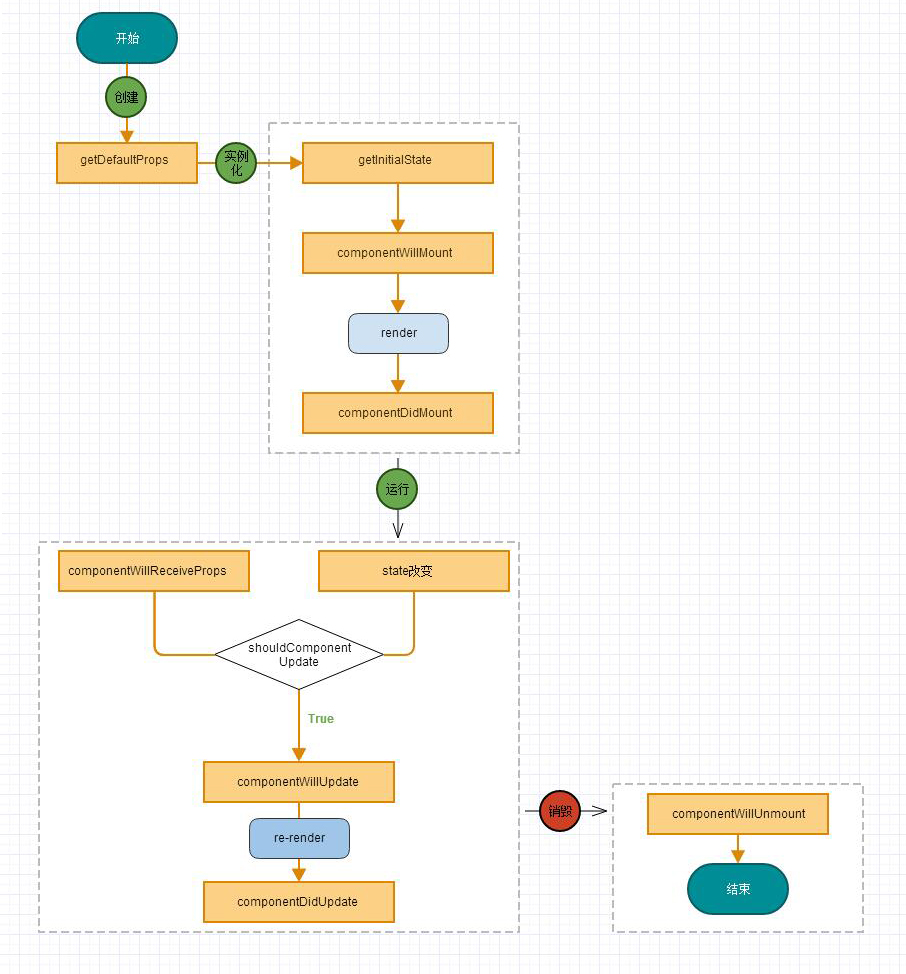

title: RN（react native）入坑指南-10,组件的生命周期
date: 2016-04-24 12:36:07
tags: ['React Native']
categories: ['React Native']
author: Frank.Wu
---

<!-- more -->

**创建阶段**
getDefaultProps : 在创建类的时候调用,处理props的默认值,getDefaultProps仅会被调用一次，这里的意思是无论你会创建多少个ReactElement，这个函数都只执行一次，之后的默认props都会直接使用改函数的返回值。

**实例化阶段**

- constructor(getInitialState):初始化组件state的值,返回值会赋值给this.state属性,这是ES6版本的写法,ES5中使用的是getInitialState.在ES6的版本中有些不太一样，相对与getDefaultProps，ES6将默认属性对象作为了构造函数的一个属性，而getInitialState则变成了在其构造器函数中给this.state赋值.

- componentWillMount:render之前调用

- render:渲染并返回一个虚拟dom

- componentDidMount:render之后调用,在组件渲染完成后调用一次.

- p.s:state属性,主要用来存储组件自身需要的数据,每次数据的更新都是通过修改state属性的值,rn内部会监听state属性,一旦变化即会触发render方法更新dom

**运行阶段**

- componentWillReceiveProps:用户操作后或父组件更新后,根据用户的操作行为对页面进行调整
- shouldComponentUpdate:拦截新的props或state
- componentWillUpdate:shouldComponentUpdate返回true的情况下执行
- componentDidUpdate:组件更新后执行

**销毁阶段**

- - componentWillUnmount:销毁时调用,通常做一些取消绑定

**p.s**：绝对不要在componentWillUpdate和componentDidUpdate中调用this.setState方法，否则将导致无限循环调用。